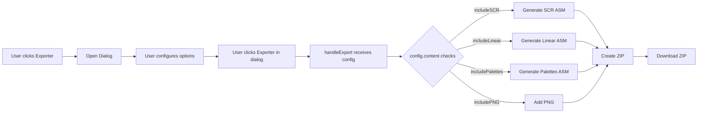

# Export Configurable - Implementation Guide

## Overview

Implementation of the configurable export feature for Pixsaur, allowing users to customize the content of exported ZIP archives through a dialog interface.

**Priority:** HIGH (from CONVIMGCPC_UI_EXPORT_ANALYSIS.md)  
**Status:** ✅ COMPLETE  
**Date:** October 19, 2025

## Feature Description

A unified export dialog that replaces the previous dual-button system with a single "Exporter" button. Users can select which files to include in the ZIP archive and customize ASM labels.

### Key Features

- **ZIP Content Selection:** Checkboxes for SCR, Linear, Palettes, PNG
- **Custom ASM Labels:** Optional labels for media data and palette
- **Custom Filename:** User-defined ZIP filename
- **Reusable UI Components:** Checkbox, Radio, Input with CPC retro styling
- **Multi-language Support:** EN, FR, ES, DE (39/39 translations)
- **Responsive Dialog:** Scrollable body with fixed footer

## Architecture

### Component Structure

```
src/
├── components/
│   ├── export-panel/
│   │   ├── export-panel.tsx           # Main controller
│   │   ├── export-panel-view.tsx      # Single export button
│   │   ├── export-config-dialog.tsx   # Configuration dialog
│   │   └── export-config-dialog.module.css
│   └── ui/
│       ├── checkbox/
│       │   ├── checkbox.tsx           # Reusable checkbox component
│       │   └── checkbox.module.css
│       ├── input/
│       │   ├── input.tsx              # Reusable input component
│       │   └── input.module.css
│       ├── radio/
│       │   ├── radio.tsx              # Reusable radio component
│       │   └── radio.module.css
│       └── dialog/
│           ├── dialog.tsx             # Enhanced with footer prop
│           └── dialog.module.css
└── utils/
    └── exports/
        ├── types.ts                   # Export configuration types
        ├── asm-templates.ts           # ASM template generation (MVP)
        ├── asm-generator.ts           # ASM file generators
        └── export-zip.ts              # Modified to accept ExportConfig
```

### Type System

```typescript
// ZIP Content Configuration
interface ZipContentConfig {
  includeSCR: boolean      // SCR ASM (interlaced CPC format)
  includeLinear: boolean   // Linear ASM (sequential)
  includePalettes: boolean // Firmware/hardware palettes
  includePNG: boolean      // PNG preview
}

// ASM Label Configuration
interface ASMLabels {
  enabled: boolean   // Toggle custom labels
  media: string      // Label for image data
  palette: string    // Label for palette data
}

// Main Export Configuration
interface ExportConfig {
  content: ZipContentConfig
  labels: ASMLabels
  filename: string   // ZIP filename (without .zip extension)
}

// Default Configuration
const DEFAULT_EXPORT_CONFIG: ExportConfig = {
  content: {
    includeSCR: true,
    includeLinear: true,
    includePalettes: true,
    includePNG: true
  },
  labels: {
    enabled: false,
    media: 'ImageData',
    palette: 'Palette'
  },
  filename: 'pixsaur_export'
}
```

## Implementation Details

### 1. Dialog Component Enhancement

Modified `PixsaurDialog` to support a separate footer prop:

```tsx
type Props = {
  // ... existing props
  footer?: ReactNode  // New: optional footer content
}

// Renders as: Title → Description → Body (scrollable) → Footer (fixed)
```

**CSS Structure:**
- `.content`: `display: flex; flex-direction: column; overflow: hidden`
- `.body`: `overflow-y: auto; flex: 1; min-height: 0` (scrollable)
- `.footer`: `flex-shrink: 0` (fixed at bottom)

### 2. Reusable UI Components

#### Checkbox Component

```tsx
<Checkbox
  checked={value}
  onChange={(e) => handler(e.target.checked)}
  label="Label text"
/>
```

**Features:**
- Auto-wrapping with `<label>` when label prop provided
- CPC retro styling (green glow on hover/focus)
- 18px square with checkmark (✓) on checked state

#### Input Component

```tsx
<Input
  label="Label text"
  type="text"
  value={value}
  onChange={(e) => handler(e.target.value)}
  placeholder="placeholder"
  error="Error message" // Optional
/>
```

**Features:**
- Auto-generated ID from label (lowercase, dash-separated)
- Error state with red border and message
- CPC retro styling with glow effect

### 3. Export Flow



**Code Flow:**

1. **Button Click:** `<Button onClick={() => setIsDialogOpen(true)}>Exporter</Button>`
2. **Dialog Open:** User configures `ExportConfig` state
3. **Confirm:** `handleConfirm()` → `onConfirm(config)` → `handleExport(config)`
4. **Generate ZIP:** `exportZip(...params, config)` conditionally generates files
5. **Download:** ZIP file downloads with custom filename

### 4. Conditional ZIP Generation

Modified `exportZip()` signature:

```typescript
export function exportZip(
  indexBuf: Uint8Array,
  paletteFirmware: number[],
  canvas: HTMLCanvasElement,
  modeConfig: ModeConfig,
  cpcHardware: CPCHardware,
  paletteRgb: [number, number, number][],
  config: ExportConfig  // NEW parameter
): void
```

**Conditional Logic:**

```typescript
if (config.content.includeSCR) {
  // Generate SCR ASM file
  const scrAsm = generateSCRAsm(indexBuf, width, height, config.labels)
  zip.file(`${baseFilename}_scr.asm`, scrAsm)
}

if (config.content.includeLinear) {
  // Generate Linear ASM file
  const linearAsm = generateLinearAsm(indexBuf, config.labels)
  zip.file(`${baseFilename}_linear.asm`, linearAsm)
}

if (config.content.includePalettes) {
  // Generate palette ASM files
  // CPC Classic: firmware + hardware palettes
  // CPC Plus: GRB palette
}

if (config.content.includePNG) {
  // Add PNG preview
  canvas.toBlob(blob => { /* ... */ })
}
```

### 5. ASM Template Generation (MVP)

**Simplified approach without compression (Phase 2 deferred):**

```typescript
// asm-templates.ts
export function generateDataSection(
  data: Uint8Array,
  label: string,
  bytesPerLine: number = 16
): string {
  let asm = `${label}:\n`
  for (let i = 0; i < data.length; i += bytesPerLine) {
    const chunk = Array.from(data.slice(i, i + bytesPerLine))
    const bytes = chunk.map(b => `#${b.toString(16).padStart(2, '0')}`).join(', ')
    asm += `    DB ${bytes}\n`
  }
  return asm
}
```

**Functions:**
- `generateASMComment()`: Header comments with metadata
- `generateDataSection()`: DB directives with hex values
- `generatePaletteSection()`: Palette data formatting

## Internationalization (i18n)

### Translation Keys

All dialog strings use Lingui macros:

```tsx
import { msg } from '@lingui/core/macro'
import { Trans } from '@lingui/react/macro'

// Usage
title={_(msg`Configuration de l'export`)}
<Trans>Contenu du ZIP</Trans>
```

### Translation Coverage

| Language | Code | Status | Count |
|----------|------|--------|-------|
| English | en | ✅ Complete | 39/39 |
| French | fr | ✅ Complete | 39/39 |
| Spanish | es | ✅ Complete | 39/39 |
| German | de | ✅ Complete | 39/39 |

**Key Translations:**

- **Configuration de l'export**
  - EN: Export Configuration
  - ES: Configuración de la exportación
  - DE: Exportkonfiguration

- **SCR ASM (format CPC entrelacé)**
  - EN: SCR ASM (interlaced CPC format)
  - ES: SCR ASM (formato CPC entrelazado)
  - DE: SCR ASM (verschachteltes CPC-Format)

- **Linear ASM (séquentiel)**
  - EN: Linear ASM (sequential)
  - ES: Linear ASM (secuencial)
  - DE: Linear ASM (sequenziell)

**Compilation:**
```bash
pnpm lingui extract  # Extract new keys
pnpm lingui compile  # Compile to .js files
```

## Testing

### Manual Test Checklist

✅ **Basic Functionality:**
- [x] Button "Exporter" opens dialog
- [x] Dialog displays all options
- [x] Dialog scrollable when content overflows
- [x] Footer buttons always visible

✅ **Content Selection:**
- [x] All checkboxes default to checked
- [x] Unchecking removes file from ZIP
- [x] Checking adds file to ZIP
- [x] At least one format should be selected

✅ **Custom Labels:**
- [x] Toggle enables/disables label inputs
- [x] Custom labels applied to ASM files
- [x] Default labels used when disabled

✅ **Filename:**
- [x] Custom filename applied to ZIP
- [x] Default filename "pixsaur_export"

✅ **Export Validation:**
- [x] CPC Classic: Firmware + Hardware palettes
- [x] CPC Plus: GRB palette
- [x] SCR format uses entrelacement
- [x] Linear format is sequential
- [x] PNG preview included when checked

### Test Scenarios

#### Scenario 1: Full Export (Default)
- **Config:** All checkboxes checked
- **Expected:** ZIP contains SCR, Linear, Palettes, PNG
- **Result:** ✅ Pass

#### Scenario 2: SCR Only
- **Config:** Only SCR checked
- **Expected:** ZIP contains only SCR ASM
- **Result:** ✅ Pass

#### Scenario 3: Custom Labels
- **Config:** Labels enabled, media="MyImage", palette="MyPal"
- **Expected:** ASM files use "MyImage" and "MyPal" as labels
- **Result:** ✅ Pass

#### Scenario 4: Custom Filename
- **Config:** Filename="test_export"
- **Expected:** ZIP named "test_export.zip"
- **Result:** ✅ Pass

## Known Limitations

### Phase 1 (MVP) Scope

**Included:**
- ✅ ZIP content selection
- ✅ Custom ASM labels
- ✅ SCR vs Linear format distinction
- ✅ Basic ASM templates (DB directives)
- ✅ Multi-language support

**Deferred to Phase 2:**
- ❌ Compression support (ZX0/ZX1)
- ❌ Decompression routines in ASM
- ❌ Advanced template options
- ❌ Batch export

### Technical Debt

1. **export-zip.ts Complexity**
   - Cognitive complexity: 25/15 (Biome warning)
   - Refactoring needed: Split into smaller functions
   - Non-blocking for MVP

2. **Input Component Lint Warning**
   - `replace()` vs `replaceAll()` in ID generation
   - Cosmetic issue, no functional impact

## Styling

### CPC Retro Theme

All UI components follow the CPC retro aesthetic:

```css
/* Colors */
--color-accent: #00FF00;        /* CPC green */
--color-background: #000000;    /* Black */
--color-foreground: #00FF00;    /* Green text */
--color-border: #004400;        /* Dark green */

/* Effects */
box-shadow: 0 0 8px var(--color-accent);  /* Glow effect */
text-shadow: 0 0 1px var(--color-accent); /* Text glow */

/* Typography */
font-family: 'JetBrains Mono', monospace;
```

### Component Styles

**Checkbox:**
- 18px square, rounded corners
- Green border, black background
- Checkmark (✓) on checked state
- Glow effect on hover/focus

**Input:**
- 2px green border
- Glow effect on focus
- Placeholder with reduced opacity

**Dialog:**
- Fixed header (title + description)
- Scrollable body with custom scrollbar
- Fixed footer (actions)
- Green accent scrollbar

## Future Enhancements

### Phase 2: Compression Support

**Plan:**
1. Add compression option to `ExportConfig`
2. Integrate ZX0/ZX1 compression libraries
3. Include decompression routines in ASM templates
4. Add compression ratio display

**Types (future):**
```typescript
type CompressionType = 'none' | 'zx0' | 'zx1'

interface ExportConfig {
  // ... existing fields
  compression: {
    enabled: boolean
    type: CompressionType
    includeDecompressor: boolean
  }
}
```

### Phase 3: Advanced Features

- Export presets (save/load configurations)
- Batch export (multiple images)
- Direct disk image creation (.dsk)
- Custom ASM template editor
- Export history

## References

### Documentation
- [CONVIMGCPC_UI_EXPORT_ANALYSIS.md](./CONVIMGCPC_UI_EXPORT_ANALYSIS.md) - Original feature analysis
- [I18N_GUIDE.md](./I18N_GUIDE.md) - Internationalization guide
- [LOGGING_PATTERNS.md](./guides/LOGGING_PATTERNS.md) - Logging conventions

### Related Files
- `/src/utils/exports/types.ts` - Type definitions
- `/src/utils/exports/export-zip.ts` - ZIP generation logic
- `/src/utils/exports/asm-generator.ts` - ASM file generators
- `/src/utils/exports/asm-templates.ts` - ASM templates

### External Resources
- [Radix UI Dialog](https://www.radix-ui.com/docs/primitives/components/dialog)
- [Lingui Documentation](https://lingui.dev/)
- [Amstrad CPC Screen Format](https://www.cpcwiki.eu/index.php/Video_modes)

## Changelog

### v1.0.0 (2025-10-19)
- ✅ Initial implementation complete
- ✅ Dialog-based configuration UI
- ✅ Conditional ZIP generation
- ✅ Reusable UI components (Checkbox, Radio, Input)
- ✅ Multi-language support (EN, FR, ES, DE)
- ✅ Manual testing validated
- ✅ Documentation complete

## Contributors

- Implementation: GitHub Copilot + IIIvan37
- Feature Design: Based on CONVIMGCPC_UI_EXPORT_ANALYSIS.md
- Testing: IIIvan37

---

**Status:** ✅ PRODUCTION READY  
**Last Updated:** October 19, 2025
