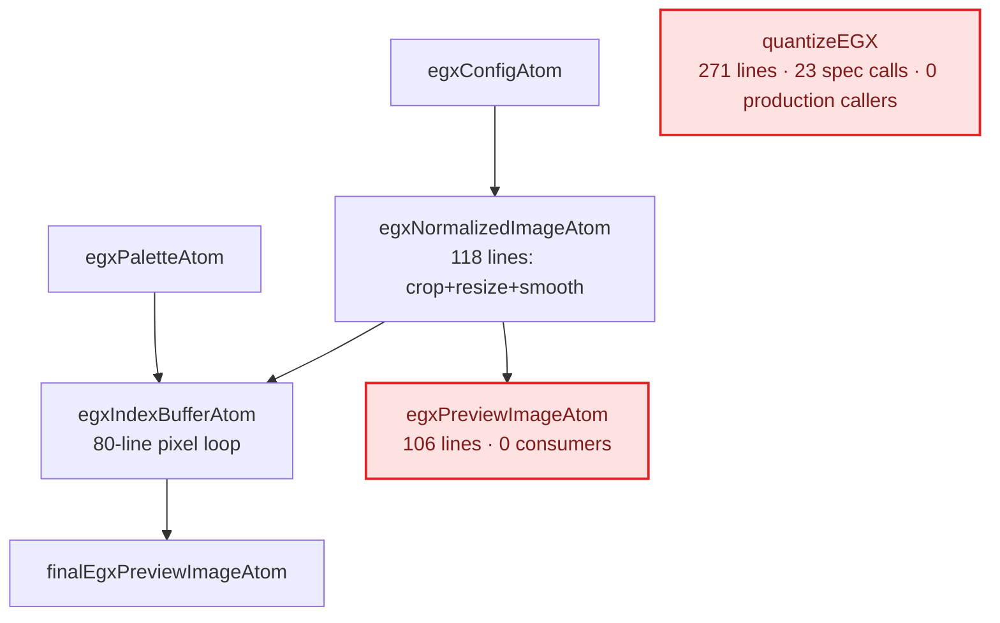
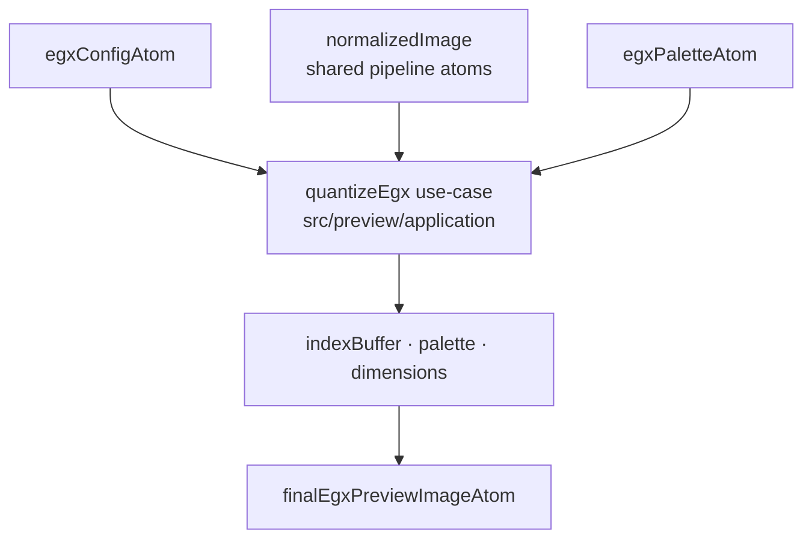
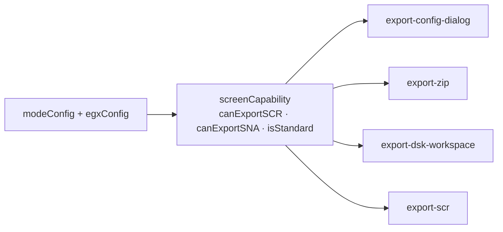

# Architecture review — August 2026

**Date**: 2026-08-26 · **Base**: `main` @ `96980d7` (post-1.13.0) ·
**Scope**: the hot spots of the last four months — the preview pipeline, the
export subsystem, and the CPU/GPU processor seam.

Vocabulary is the deep-module one: **module** (interface + implementation),
**interface** (everything a caller must know — types, invariants, ordering
constraints, error modes), **depth** (leverage per unit of interface), **seam**
(a place you can alter behaviour without editing in that place), **adapter**,
**leverage**, **locality**. The **deletion test**: imagine deleting the module —
does complexity vanish (pass-through) or reappear across N callers (earning its
keep)? And: *one adapter means a hypothetical seam, two means a real one.*

Every file and line reference below was read; every "0 callers" claim was
verified by grep across `src/`.

## Summary

| # | Candidate | Strength |
|---|---|---|
| 1 | [Give the EGX rendering path one module](#1--give-the-egx-rendering-path-one-module) | **Strong** |
| 2 | [Make the distinct-mapping channel visible](#2--make-the-distinct-mapping-channel-visible) | **Strong** |
| 3 | [Split the processor seam that has one adapter](#3--split-the-processor-seam-that-has-one-adapter) | **Strong** |
| 4 | [Give the standard-mode verdict a home](#4--give-the-standard-mode-verdict-a-home) | **Strong** |
| 5 | [Name the ASM artifact producers](#5--name-the-asm-artifact-producers) | **Strong** |
| 6 | [Collapse the SNA production run](#6--collapse-the-sna-production-run) | **Strong** |
| 7 | [Make the async-atom read order unforgettable](#7--make-the-async-atom-read-order-unforgettable) | **Strong** |
| 8 | [One interface for the three rendering paths](#8--one-interface-for-the-three-rendering-paths) | Worth exploring |
| 9 | [Fold the dynamic-palette dither twins back in](#9--fold-the-dynamic-palette-dither-twins-back-in) | Worth exploring |
| 10 | [Route DSK export through the FileSink port](#10--route-dsk-export-through-the-filesink-port) | **Strong** |
| 11 | [Flatten the preview barrels](#11--flatten-the-preview-barrels) | Speculative |

---

## 1 · Give the EGX rendering path one module

**Strength**: Strong · **Dependency category**: in-process

**Files**: `src/app/store/preview/egx/egx-index-buffer.ts:26-131` ·
`egx-preview-image.ts:43-105` · `egx-final.ts:18-62` · `egx-image.ts:37-155` ·
`src/libs/pixsaur-egx/quantize-egx.ts:40`

**Problem** — The store hand-rolls EGX quantization across four atoms while
`quantizeEGX` (271 lines, 23 spec calls) has **zero production callers**. The
tested implementation and the shipped one are different code.

`egxIndexBufferAtom` re-implements the whole thing inline: an 80-line pixel
loop, pair-averaging on low-res lines, `findClosestInSubset`, `getMaxColorIndex`,
`getModeForLine`. `egxPreviewImageAtom` (106 lines) calls
`applyEGXDitheringByMode` a second time with identical arguments and has no
consumer — only two barrels re-export it. `egxNormalizedImageAtom` (118 lines)
redoes crop → resize → smooth without touching the standard pipeline atoms, and
bypasses `resampleStrategy` entirely, so EGX never gets the linear-light
resampler.

**Before**



**After**



**Solution** — One `quantizeEgx` use-case owning dithering → index buffer →
palette; the store keeps a single adapter atom; the crop→resize→smooth chain
takes a target `CpcModeConfig` instead of forking.

**Deletion test** — Delete `egx-preview-image.ts` and only an 8-line
`shouldGrayOut` survives: pass-through. Delete `egx-image.ts`'s resize block and
it reappears in the standard pipeline atoms, which already have it.

**Wins** — Locality: one EGX implementation · zero EGX atom specs exist today ·
testable as a table over `(egx1|egx2) × (low|high firstLine) × dithering mode` ·
~200 atom lines deleted · EGX gains linear-light resampling.

---

## 2 · Make the distinct-mapping channel visible

**Strength**: Strong · **Dependency category**: in-process

**Files**: `src/libs/pixsaur-color/src/quant/color-mapping-cache.ts:16-19` ·
`map/map-and-dither.ts:528,543,1297` ·
`src/libs/pixsaur-adapter/adapters/regl-quantizer.ts:218,851,857,870` ·
`quant/quantize.ts:139-152`

**Problem** — A module-level mutable singleton (`let currentColorMapping`,
`let isDistinctMappingActive`) carries the source→index mapping from the GPU
quantizer to the ditherer. Nothing in either interface mentions it, and
`mapAndDither` **silently discards the caller's dithering mode** when it is set
(`if (isDistinctMappingEnabled()) return applyNoDither(...)`).

The CPU path never writes it — `quantize.ts:139-152` throws away
`strategyResult.colorMapping` — and never clears it. Zero specs reference
`setColorMapping`, `lookupColorIndex` or `isDistinctMappingEnabled`.

> **Concrete failure.** `ReGLQuantizer` throws for images under 128×128
> (`regl-quantizer.ts:186-190`) *before* reaching `clearColorMapping()` at
> `:218`. The CPU fallback then maps the new image's pixels through the previous
> image's table, with dithering silently forced off.

**Before** — the two modules communicate under their declared interfaces:

```
  ReGLQuantizer ──── palette ───▶ mapAndDither
       │                              ▲
  - - -│- - - - - - - - - - - - - - - │- - - -  declared interface
       │                              │
       └──▶ color-mapping-cache ──────┘
            let currentColorMapping        (module-level mutable state)
```

**After** — the channel becomes a value:

```
  quantizePalette ──▶ { palette, sourceColorMapping? } ──▶ mapAndDither(…, sourceColorMapping?)

  - - - - - - - - - - - - - - - - - - - - - - - - - - -   declared interface
                        (nothing below it)
```

**Solution** — `quantizePalette` returns `{ palette, sourceColorMapping? }`;
`mapAndDither` takes it as an explicit optional argument.

**Deletion test** — Delete the module and complexity vanishes; it reappears only
as one extra field threaded through two call sites.

**Wins** — Distinct-mapping becomes testable at all · the interface stops lying ·
removes cross-image state · CPU and GPU paths converge · smallest Strong
candidate here.

---

## 3 · Split the processor seam that has one adapter

**Strength**: Strong · **Dependency category**: ports & adapters

**Files**: `src/libs/pixsaur-adapter/interfaces.ts:43-125` · `factory.ts:12-38` ·
`adapters/regl-processor.ts:284,444,500-740,763,876` ·
`src/preview/application/ports.ts:24` · `src/raster/application/ports.ts:34`

**Problem** — `ImageProcessor` declares 5 methods plus 2 readonly props, and all
three factory entry points (`'cpu' | 'gpu' | 'auto'`) return the **same class**,
differing only by whether `regl` is passed. `createCpuProcessor`,
`createReGlProcessor` and `isWebGlAvailable` are declared in `ProcessorFactory`
and **implemented nowhere**. One adapter means a hypothetical seam.

Callers *do* have to know which one they got: `applyAdjustmentsSync` is declared
synchronous "for Jotai" but blocks on `regl.read()` on the GPU path, and
`quantizePaletteOptimized` has no `options` parameter, so `autoDistinctMapping`
and `colorDiversity` are silently dropped on fallback.

Mass comparison — interface surface vs implementation:

```
before                              after
┌──────────────────┐                ┌──────────────────┐
│    INTERFACE     │  5 methods     │    INTERFACE     │  the two Pick<> facets
│                  │  2 props       └──────────────────┘  the ports already use
│                  │  7-param quant  ┌───────┐ ┌───────┐
│                  │  sync+async     │  GPU  │ │  CPU  │
├──────────────────┤                 │       │ │       │
│  IMPLEMENTATION  │  one class      │       │ └───────┘
│                  │  5× if(regl)    │       │
└──────────────────┘                 └───────┘
```

**Solution** — Two implementations (`GpuProcessor`, `CpuProcessor`) behind the
narrow port facets the application layer already declares; the factory owns the
fallback decision once.

**Deletion test** — Delete `ImageProcessor` today and complexity mostly
*vanishes*: the two real consumers already narrow it with `Pick<>`. The wide
interface earns nothing.

**Wins** — Two adapters justify the seam · one conformance suite replaces
`regl-processor.spec.ts`'s 686 lines of wholesale mocking · options stop
vanishing on fallback · latency stops hiding behind a `Sync` suffix.

---

## 4 · Give the standard-mode verdict a home

**Strength**: Strong · **Dependency category**: in-process

**Files**: `src/export/exports/dsk-workspace-utils.ts:87` ·
`exporters/export-dsk-workspace.ts:60` · `exporters/export-dsk-workspace-zip.ts:34` ·
`export-zip.ts:383-411` · `export-scr/export-scr.ts:23` ·
`src/components/export-panel/export-config-dialog.tsx:46-65`

**Problem** — The `{mode 0/160, 1/320, 2/640} × 200 × !overscan` rule is
re-implemented five times with four different signatures:

| Site | Signature | Specced |
|---|---|---|
| `dsk-workspace-utils.ts:87` | `(width, height, mode, overscan)` | yes |
| `export-dsk-workspace.ts:60` | `(modeConfig)` | no |
| `export-dsk-workspace-zip.ts:34` | `(config)` | no |
| `export-config-dialog.tsx:46` | inline, plus `canExportSNA` | via render |
| `export-zip.ts:383` | inline, plus an EGX arm | no |

`export-zip.ts:404` carries the comment *"Must match the UI logic in
export-config-dialog.tsx"* — an admission that the invariant has no home. The
dialog knows a `canExportSNA` rule that `export-zip` does not.

**After**



**Solution** — One module answering "what can this mode config produce",
consumed by the dialog and every exporter.

**Deletion test** — Earns its keep: this is exactly the complexity that
reappears across five call sites today.

**Wins** — Leverage: one rule, five readers · UI and exporter cannot drift · the
rule leaves the React tree · one table-driven spec.

---

## 5 · Name the ASM artifact producers

**Strength**: Strong · **Dependency category**: in-process

**Files**: `src/export/exports/export-zip.ts:165-275,208-217` ·
`exporters/export-cpc-playground.ts:172-236,241-302` ·
`exporters/export-sna.ts:73-97,422-449` · `templates/egx-templates.ts` (753 lines,
no spec)

**Problem** — Two artifacts have no name, so they are re-derived at every site.

The palette-ASM emission (`firmwareToHardware[fw] ?? 0x54` → hex-pad →
`Palette_Hardware: DB …`) is written out at **6 sites**; the CPC-Plus `DEFW`
variant twice. The EGX ASM source is the same ~60-line procedure three times:

```
pick template by overscan × hardware
firmwareToHardware[fw] ?? 0x54 → hex pad → DB
slice linear data at floor(len/2)
toASMData ×2
unwrap  string | Chunk[]     ← ×6 in these three functions alone
assembleEgxSnaSource
```

The two playground variants differ on **31 of ~63 lines** — half is identical.
That `string | Chunk[]` union is `toASMData`'s shallow interface leaking.

**Solution** — Two modules:

- `paletteAsm(palette, { hardware, label, colorCount })` — owns the
  firmware→hardware map, the `0x54` fallback, the colour-count slice
- `egxAsmSource(indexBuf, dims, egxConfig, palette, hardware)` — owns the
  overscan chunk split and the template choice

**Deletion test** — Earns its keep at six sites. The Z80 template *bodies* do
not — that variation is real hardware difference (see [Healthy](#checked-and-healthy--leave-alone)).

**Wins** — The `0x54` fallback gets asserted · `egx-templates.ts` becomes
reachable from a spec · the union unwrap moves inside · locality: one place per
artifact.

---

## 6 · Collapse the SNA production run

**Strength**: Strong · **Dependency category**: local-substitutable

**Files**: `src/export/exports/exporters/export-sna.ts:186-326,332-392,455-595,601-665` ·
`export-zip.ts:258-274,346-570` · `exporters/export-scr.ts:37-96`

**Problem** — `export-sna.ts` is 665 lines that are two copies of one procedure.
`exportSna` (141 lines) and `generateSnaAsmSource` (61) share their whole body
minus the RASM call; `exportModeRSna` (141) and `generateModeRSnaAsmSource` (65)
likewise. The RASM invoke block (`await import('@/libs/rasm-wasm')` →
`createRasmInstance` → `assemble(…)` → check success → check snapshot) appears at
**3 sites**.

`export-sna.spec.ts` needs **5 `vi.mock` calls** because collaborators are
reached by static/dynamic import rather than parameters. And
`export-zip.spec.ts` (435 lines, 16 tests) never sets `includeSNA: true` and
never passes `egxConfig` — so `exportEgxSnaToZip` (110 lines) and `exportSnaToZip`
are **completely untested**, because they cannot be reached without a real RASM
WASM instance.

**Solution** — One `asmSource(spec) → string` (pure) and one
`assembleSnapshot(source, filename)` (the only module touching `rasm-wasm`);
`exportSna` becomes their composition.

**Deletion test** — The `exportSna` / `generateSnaAsmSource` pair: delete one and
nothing reappears — pure duplication. The RASM invoke block earns its keep at
three sites.

**Wins** — The pure half is testable without RASM · the untested SNA arms become
reachable · ~80% of the spec loses its mocks · ~200 duplicated lines deleted.

---

## 7 · Make the async-atom read order unforgettable

**Strength**: Strong · **Dependency category**: in-process

**Files**: `src/app/store/preview/pipeline/image-pipeline.ts:57` (the only place
the rule is written down) · `preview-image.ts:104-121` · `quantization.ts:119-145` ·
`index-buffer.ts:63-68` · `egx/egx-index-buffer.ts:38-41`

**Problem** — `image-pipeline.ts:57` states the rule: *"Read all atoms
synchronously (before any await) so Jotai tracks them."* Roughly **45 `get(...)`
calls occur after an `await get(...)`** across `store/preview/**` (Jotai 2.12.4).
`previewImageAtom` awaits at lines 105, 106, 116 and then reads four config atoms
at 117-120; `quantizedPaletteAtom` awaits twice then reads seven config atoms.

This is the clearest case of *pure functions extracted for testability while the
real bugs hide in how they are called*: `ditherImage` and `quantizePalette` each
have a spec, but "moving the dithering slider recomputes the preview" is asserted
nowhere.

```ts
// before — the invariant lives in a comment
const a = await get(quantized)
const b = await get(smoothed)
const d = get(effectiveDithering)   // ← after the await
const e = get(effectiveModeConfig)  // ← after the await

// after — the order is the interface
deriveAsync({ dithering: effectiveDithering, modeConfig: effectiveModeConfig },
  async (deps, get) => ditherImage(await get(quantized), deps))
```

**Solution** — A small `deriveAsync(deps, compute)` helper that collects the sync
reads up front and hands them to the use-case.

**Deletion test** — The use-cases earn their keep; the *locality* is what is
broken. Fix the adapter shape, not the use-cases.

**Wins** — The invariant moves into a module · one shape for all 42 atoms ·
recomputation becomes assertable at store level · locality: the failure mode has
an address.

---

## 8 · One interface for the three rendering paths

**Strength**: Worth exploring · **Dependency category**: in-process

**Files**: `src/app/store/raster/raster-preview.ts:86-121` (the only dispatch) ·
`preview/pipeline/index.ts` · `preview/egx/index.ts` · `preview/mode-r/index.ts`

**Problem** — The switch between paths lives in the **raster** slice, not the
preview slice, as a 35-line priority chain with no spec. The three paths expose
incompatible surfaces, and the asymmetry is invisible from any interface:
`grep manualPixelEdits src/app/store/preview/mode-r` returns **0 hits**, so
manual edits silently do nothing in Mode R.

"Effective dithering" also means three different things: the standard path forces
`'none'` under distinct-mapping (`preview-image.ts:80-88`), while EGX
(`egx-index-buffer.ts:41`) and Mode R (`mode-r-config.ts:24`) read the raw atom.

**Solution** — One `RenderingPath` shape
(`{ previewImage, indexBuffer, displayPalette, exportData }`) with three
adapters, so the dispatch selects an adapter instead of branching.

**Deletion test** — No module to delete: the seam is *missing*, which is why the
dispatch grew a hard-coded precedence list. Three adapters already exist in
substance → real seam.

**Wins** — Capability gaps become declared · the dispatch returns to the preview
slice · one "effective dithering" · a new path gets a checklist.

**Sequencing** — Largest blast radius here. Do it *after* candidate 1 shrinks the
EGX side.

---

## 9 · Fold the dynamic-palette dither twins back in

**Strength**: Worth exploring · **Dependency category**: in-process

**Files**: `src/libs/pixsaur-color/src/map/map-and-dither.ts:449-660` vs
`:1048-1241` · `:1324` (second entry point) · `:1353-1396` (second switch) ·
`:920-1040` (the healthy registry)

**Problem** — `mapAndDitherWithDynamicPalette` is a second entry point with its
own switch over only **4 of the 11 modes**, backed by three near-clones
(`applyBayerDitherWithDynamicPalette` 79 lines, `applyNoDither…` 44,
`applyBlueNoiseDither…` 71) duplicating their static twins. Compare `:516-577`
with `:1127-1165`: same loop, except the dynamic twin re-runs `buildPalette()`
per scanline and silently drops distinct-mapping support.

Raster mode therefore gets 4 of 11 modes and 6 smoke tests asserting only
dimensions and palette membership.

**Solution** — One `DitherFn` taking a per-line palette provider; the static path
passes `() => palette`, the raster path passes `(y) => buildPalette(y)`.

**Deletion test** — Delete the three twins: complexity vanishes once the static
path is expressed as a provider. The `DitherFn` signature already takes the
palettes positionally.

**Wins** — Raster gets all 11 modes · ~190 clone lines deleted · the existing
11-mode suite applies to raster · one entry point to learn.

---

## 10 · Route DSK export through the FileSink port

**Strength**: Strong · **Dependency category**: ports & adapters

**Files**: `src/components/dsk-workspace/dsk-workspace-panel.tsx:206-238` ·
`src/export/application/ports.ts:38` · `application/file-sink.ts:15` ·
`exporters/export-dsk-workspace.ts:213-233,327` ·
`exporters/export-dsk-workspace-zip.ts:66-81,210`

**Problem** — DSK is the one export with no use-case. The panel branches on
`isTauri()` and calls `saveZipFileTauri` / `downloadFile` by hand, while the
`FileSink` port that does exactly this **already exists and is unused here**.
`generateStandardScr` exists twice (once sync, once with 3 dynamic imports) and
`processImage` exists twice with the same standard/linear fork.

`export-dsk-workspace.spec.ts` needs **8 `vi.mock` calls** to get through.

**Solution** — An `exportDskWorkspaceToZip(input, { fileSink })` use-case beside
the two that already exist, sharing one SCR-with-palette producer.

**Deletion test** — Earns its keep: this is the third caller of the save
decision, and the one that drifted.

**Wins** — The platform branch leaves the UI · 8 `vi.mock` calls → 0 on the save
path · matches the two shipped use-cases · one SCR producer, not two.

---

## 11 · Flatten the preview barrels

**Strength**: Speculative · **Dependency category**: in-process

**Files**: `src/app/store/preview/preview.ts` → `pipeline/index.ts` → 7 files ·
`egx-preview.ts` → `egx/index.ts` → 6 files · `mode-r-preview.ts` →
`mode-r/index.ts` → `mode-r-preview.ts` (marked `@deprecated` at line 4) → 5 files

**Problem** — Three pure re-export modules, ~180 lines of export lists. Reaching
`finalPreviewImageAtom` means opening three files before any code. A spec still
imports through the barrel its own module marks deprecated.

**Deletion test** — Delete them and nothing reappears — pass-through. But it
touches many import sites and buys the least.

> **ADR-001 note** — *"L'organisation interne de `src/app/store` est gelée pendant
> le refactor strangler-fig."* That refactor shipped in 1.13.0, so the freeze has
> expired on its own terms. Still, this is the only candidate asking to reopen it.

**Sequencing** — Not worth a PR of its own; it falls out of candidate 8.

---

## Dead modules found in passing

Not deepening opportunities — just deletions. Each verified by grep across `src/`.

| Module | Location | Evidence |
|---|---|---|
| `quantizeEGX` | `libs/pixsaur-egx/quantize-egx.ts:40` | 271 lines, 23 spec calls, 0 production callers — adopt (candidate 1) or delete |
| `exportModeRSna` | `exporters/export-sna.ts:455` | 141 lines, reachable only from its own spec |
| `generateSCRAsmPlus` | `exporters/export-scr.ts:37` | no call sites; its body is inlined at `:55-76` instead |
| `egxPreviewImageAtom` | `store/preview/egx/egx-preview-image.ts` | 106 lines, re-exported by two barrels, consumed by nothing |
| `getCapabilities` | `adapters/regl-processor.ts:876` | outside the interface, referenced only by its own spec |
| `effectiveDitheringAtom` | exported through 3 barrels | one internal reader |

Also: `export-raster-pipeline.spec.ts` (357 lines) names a module that **does not
exist**. It stitches `injectPaletteDataIntoSCR` + `generateClassicRasterASM` +
`rgbToIndexBufferExact` and asserts they agree on firmware indices. That
invariant is real, cross-cutting, and homeless.

## Checked and healthy — leave alone

- **The palette strategy seam.** `PALETTE_STRATEGY_MAP`
  (`palette-strategies-v2.ts:2262-2277`) is a real registry of **14** strategies
  behind one dispatch used by both quantizers — no switch chain, and
  `isValidPaletteStrategy` / `AVAILABLE_STRATEGIES` derive from the map, so no
  drift is possible. 97 tests across 30 describes. The balanced/max pairs are
  already deduplicated via 4 shared cores: 8 strategies, 4 implementations.
- **The `DITHER_MODES` registry** (`map-and-dither.ts:920-1040`). 11 modes behind
  one `DitherFn`. `mapAndDither` is genuinely deep: 6 params, ~1200 lines behind
  them. Not a grab-bag.
- **The application ports.** `Pick<ImageProcessor, 'quantizePalette'>`
  (`src/preview/application/ports.ts:24`) and
  `Pick<…, 'renderRasterPreview'>` (`src/raster/application/ports.ts:34`) are
  exactly the right narrowing. `FileSink` and `PlaygroundPort` each have **two**
  adapters (web + Tauri) — real seams.
- **The two shipped export use-cases.** `export-image-to-zip.ts:101` and
  `open-image-in-playground.ts:176` both have the `(input, deps) => Result` shape,
  discriminate their branches with a proper `A | B | null` union rather than
  optional flags, and test without RASM.
- **The Mode R quantization adapter** (`mode-r/mode-r-quantization.ts:24-67`). A
  40-line atom over a 1489-line lib. Textbook depth — the model candidate 1
  should copy.
- **The Z80 template bodies.** Classic vs Plus is real hardware variation
  (gate-array `setPalette` loop vs ASIC unlock + `ldir` to `#6400`), already
  factored into named shared constants (`PLUS_ASIC_ROUTINES`, `SYNC_ROUTINES`,
  `OVERSCAN_DISPLAY_ROUTINES`, `CLASSIC_RASTER_MACRO`, `MODE_R_COMMON_ROUTINES`).
  Only the RASM preamble repeats across 11 generators.
- **`src/domain/cpc/**`.** Seven small modules, each with its own spec,
  aggregated by an `index.ts` that documents the ISP intent.
- **`src/preview/image-processing/`.** `image-resize`, `horizontal-resample`,
  `horizontal-smoothing`, `resize-resample` — all pure, all specced (760 spec
  lines between them), correct layer, correct depth.
- **`pipeline/manual-edits.ts:102-121`.** `applyManualEditsToBuffer` is pure,
  tested, and reused by both the standard and EGX paths. Two callers = real seam.
- **`pipeline/palette-export.ts`.** `processSlot` + `exportPaletteWithSlotsAtom`
  carry real slot logic, covered by a dedicated 267-line spec.
- **`mode0-hue-diversity.ts`.** One implementation, tuning injected as a
  parameter with two presets, 827 spec lines. Per ADR-001, untouched — and it
  should stay that way.
- **`cpu-convolution.ts`.** Five exported pure functions, 20 focused tests
  including an isolated-outlier median case and a vertical-edge Sobel case.
- **The `rasm-wasm` interface.** `assemble(source, { outputFile, exportType, … })`
  — 401 lines plus WASM behind four params, with its own concurrency spec. Deep.

### Coverage gaps worth noting

Not refactors, but no spec exists for: `egx-templates.ts`,
`export-scr/export-scr.ts`, `export-egx-scr.ts`,
`export-linear-asm/export-linear.asm.ts`, `exporters/export-scr.ts`,
`export-linear.ts`, `export-palette.ts`, `generate-dsk-readme-pdf.ts`, and no
EGX store atom has one.

---

## Top recommendation

**[Candidate 1 — Give the EGX rendering path one module](#1--give-the-egx-rendering-path-one-module).**

It is the only candidate where the tested implementation and the shipped one are
different code. Four atoms in a hot spot hand-roll what a 271-line lib module
already does under 23 spec assertions, and no EGX atom has a spec at all — so the
EGX path is both the least covered and the most duplicated part of the pipeline.
Fixing it deletes ~200 lines, gives EGX the linear-light resampler it currently
skips, and shrinks the surface that candidate 8 would otherwise have to unify.

Cheapest Strong win to pair with it: **candidate 2** — one return value replaces
a global, and closes a real stale-state failure.

## Suggested sequencing

| Wave | Candidates | Tooling |
|---|---|---|
| 1 — correctness | 2, plus the dead-module sweep | — |
| 2 — extractions | 1 (top reco), 10 | `.claude/skills/extract-use-case` |
| 3 — export | 4, 5, 6 | `.claude/skills/extract-use-case` |
| 4 — structural | 3, 7, 8, 9 | — |

Close each PR with `.claude/skills/refactor-preflight`, then
`.claude/skills/session-report`, as with the 15 PRs of the clean-archi refactor.
Candidate 11 is not worth a PR of its own — it falls out of candidate 8.
